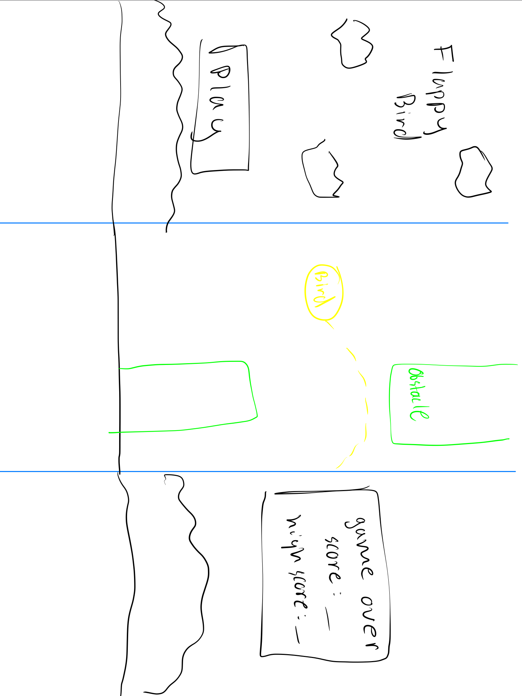

:warning: Everything between << >> needs to be replaced (remove << >> after replacing)

# << Project Title >>
## CS110 Final Project  << Semester, Year >>
Fall 2023
## Team Members

<< List team member names >>
Augustine Gonzalez
Devion Rosa
***

## Project Description

<< Give an overview of your project >>
A game where a an object is continuosly falling unless the user makes the object rise. The object must make it through diffrent obstancles wihtout touching them. Every obstacle passed is a point gained. If the object touches an obstacle the game is over 
***    

## GUI Design
1. Interactive button that start the game or quit the program bnoth at the beginning and end 
2. Score trackers that display current score and all time best score

### Initial Design

### Final Design

(assets/finalgui2.jpg)(assets/finalgui3.jpg)

## Program Design
1. Interactive Menu
2. Game where the use controls the bird's movement via space bar and must navigate through obstacles
3. Live score counter duting the gameplay
4. All time best score tracker, is kept even when the program is quit
5. Movement using space bar
6. Game over upon collision with pipes or the ground

### Features

1. << Space bar to jump up  >>
2. << moving background >>
3. << point counter >>
4. << falling object >>
5. << Push to play >>

### Classes

- 1. background: draws the background onto the screen
  2. bird: draws the bird onto the screen
  3. controller: contains application logic and event Handling
  4. ground: draws the ground onto the screen
  5. movement: resposible for updating the positions of every object necessary for their movement 
  6. pipe: draws the pipe on the screen

## ATP
1. Test Case 1: Starting Game
    a. Test Description: The game begins as expected
        i. Test Steps:
            1. Start the game
            2. Press play button 
            3. Press the space bar
            4. Verify the game begins by making the bird jump

        ii. Expected Outcome: The game should begin when the play button is pressed and then the space bar is pressed to begin the bird's movement

2. Test Case 2: Player Movement
    a. Test Description: When the space bar is pressed the bird moves
        i. Test Steps:
            1. Start the game
            2. Press the space bar
            3. Verify the bird jumps up and falls

        ii. Expected Outcome: The bird should move up and then down in respoce to a space bar input

3. Test Case 2: Collision Detection 
    a. Test Description: When the the bird hits the pipe the game is over
        i. Test Steps:
            1. Start the game 
            2. Play the game
            3. Move the bird into a pipe
            4. Verify that the game over screen comes up

        ii. Expected Outcome: The game over screen should appear when the bird hits a pipe

4. Test Case 2: Menu navigations
    a. Test Description:
        i. Test Steps:
            1. Start the game
            2. Navigate through the main menu options (Start Game, Quit)
            3. Verify that each option is selectable and leads to the expected actions.
            4. Play the game 
            5. Drive the bird into a pipe
            6. Navigate through the game over menu options (Start Game, Quit)
            7. Verify that each option is selectable and leads to the expected actions.
        ii. Expected Outcome: The main and game over menu should allow the player to navigate through options and select them.

5. Test Case 2: High Score
    a. Test Description: The main and game over menu should display a high score number
        i. Test Steps: 
            1. Start the game
            2. Play the game
            3. Verify that the number of pipes jumped through should be displayed as high score
            4. Play the game again
            5. Verify that if the amount if pipes jumped thourugh is greater then prior attempt new high score is displayed. If not high score emains the same
            6. Quit the game
            7. Start the game
            8. Verify high score remains the same
        ii. Expected Outcome: The highest number of pipes jumped through should be displayed as the high score and hig hscore should remain even if the game is quit. 

6. Test Case 6: Score Counter
    a. Test description:  Test the counter of pipes jumped through
        i. Test Steps
            1. Start the game
            2. Play the game
            3. Jump through a pipe
            4. Verify the 1 is added to the counter on the screen
        ii. Expected Outcome: Everytime the player jumps through a pipe one is added to the counter and it is displayed on the screen

